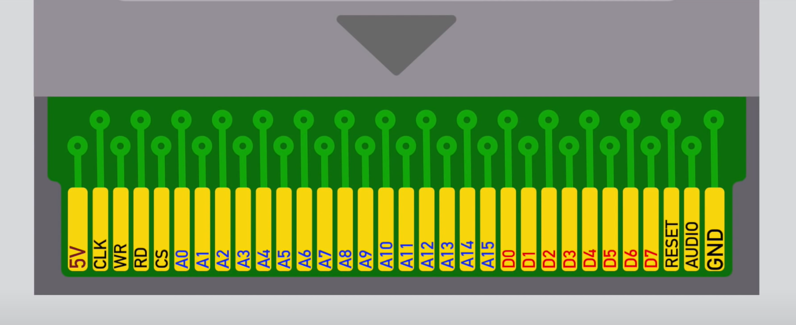
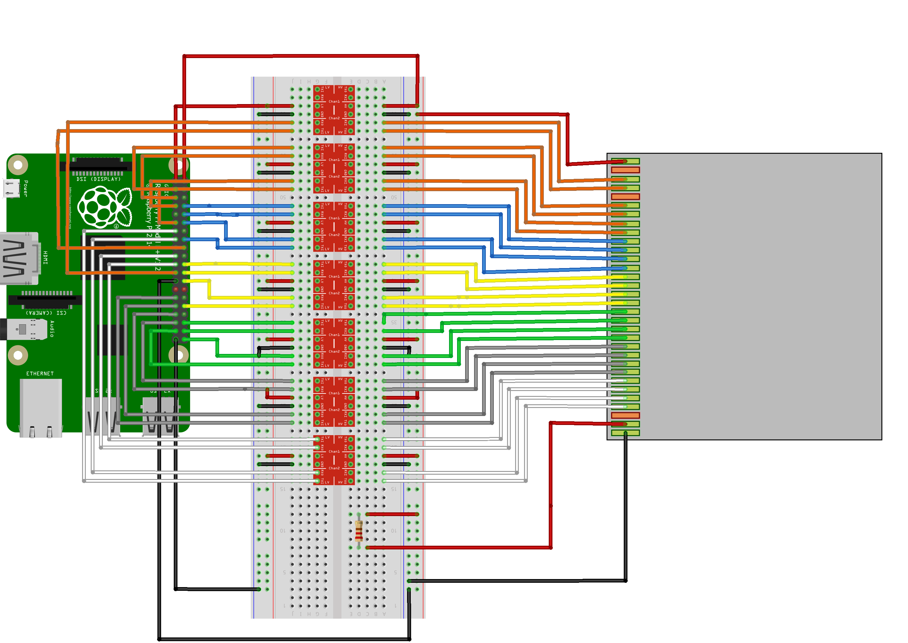

# GameBoy Cartridge Dumper

GameBoy Cartridge Dumper tool for Raspberry Pi written in golang.

## Cartridge Pin layout

- `5V` and `GND` are the power supply pins.
- `CLK` provides 1MHz to the cartridge (not used in this project)
- `~RD` & `~WR`: When `~RD` is pulled to ground and `~WR` is set in a high state the cartridge performs a read in the selected address (`A0-A15`) and writes the result to the `D0-D7` pins.
- `~CS`: Chip select, should be pulsed down (to ground) at the same time when reading or writing to the cartridge SRAM memory. If we only read from ROM memory it should be always in high.
`A0-A15`: Address line. Address to read or write to.
`D0-D7`: Data pins that allow to read or write 1 byte at a time.
`AUDIO`: Allows to play audio via the cartridge.
`RESET`: Allows the cartridge to reset the GameBoy. Ignored in the dumper.

## Hardware setup

### Required Hardware

- Raspberry Pi with at least 25 GPIO pins
- 5v to 3.3v bidirectional level shifters
- Cartridge breakout port (if you are brave enough you can directly soldier the wires directly to the cartridge pins)
- Jumper wires
- Protoboard
- 3x 10k resistors

### Game Boy logic level vs. Raspberry Pi logic level

Meanwhile the Game Boy runs at 5V, the Raspberry pi GPIO pins expect a 3.3V signal. For this reason we are forced to use a set of bidirectional level shifters.

[I've bought the first ones I found in amazon.](https://www.amazon.es/L%C3%B3gica-Canales-Convierta-M%C3%B3dulo-Bidireccional/dp/B07F84FCM4/ref=asc_df_B07F84FCM4/?tag=googshopes-21&linkCode=df0&hvadid=420354538056&hvpos=&hvnetw=g&hvrand=973969549405106601&hvpone=&hvptwo=&hvqmt=&hvdev=c&hvdvcmdl=&hvlocint=&hvlocphy=1005471&hvtargid=pla-860029515531&psc=1&tag=&ref=&adgrpid=95757266346&hvpone=&hvptwo=&hvadid=420354538056&hvpos=&hvnetw=g&hvrand=973969549405106601&hvqmt=&hvdev=c&hvdvcmdl=&hvlocint=&hvlocphy=1005471&hvtargid=pla-860029515531)

Even though the ones I bought work perfectly fine, I recommend you buying others with more channels, for instance, [these ones](https://www.amazon.es/dp/B07N7FFY2Q/ref=sspa_dk_hqp_detail_aax_0?psc=1&smid=A1X7QLRQH87QA3&spLa=ZW5jcnlwdGVkUXVhbGlmaWVyPUExQURTTUJZM09DR1kwJmVuY3J5cHRlZElkPUEwNDI3NjgxMlQyOFFTUldBUzZLNSZlbmNyeXB0ZWRBZElkPUEwOTA4NTM0MldFMFlFWTNUVjJCVyZ3aWRnZXROYW1lPXNwX2hxcF9zaGFyZWQmYWN0aW9uPWNsaWNrUmVkaXJlY3QmZG9Ob3RMb2dDbGljaz10cnVl).

### Connection schema

> The connections may not be the same ones defined in the `mapping.yaml`. Make sure you set your own mapping.yaml according to you actual connections not the ones depicted in the image above.

### The actual mess 🤣

### Important notes

- `RESET` pin is pulled up with a 10k resistor.
- ``CS` pin is pulled up with a 10k resistor (No RAM dump yet). If in a future we decide to dump the RAM as well we should control this pin from the raspberry Pi.
- `~RD` & `~WR` are pulled down with a 10k resistors.
- Even though this resistors are not mandatory they are highly recommended.

## References and helpful resources

- [1] [Pandocs](https://gbdev.io/pandocs/)
- [2] [Hacking the Game Boy cartridge protection by stacksmahing](https://www.youtube.com/watch?v=ix5yZm4fwFQ&t=462s)
- [3] [GBCartRead: Arduino based Gameboy Cart Reader by insidegadgets](https://www.insidegadgets.com/2011/03/19/gbcartread-arduino-based-gameboy-cart-reader-%E2%80%93-part-1-read-the-rom/)

